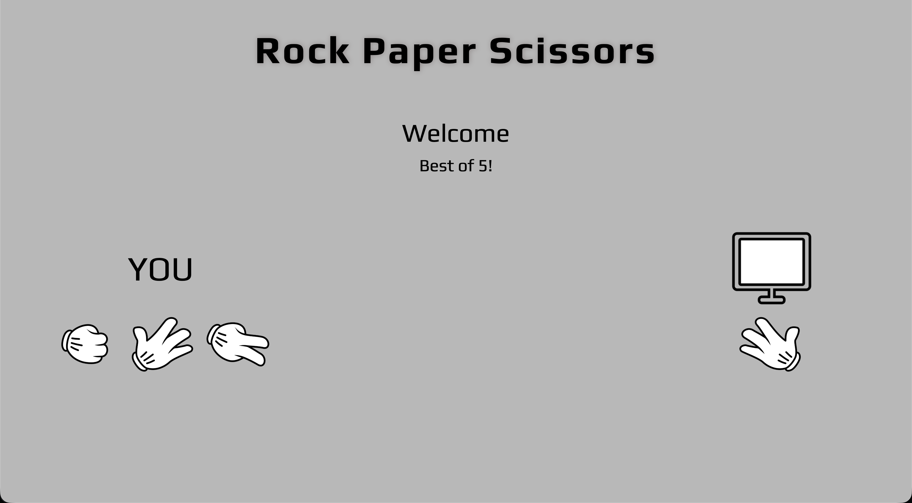

# rock-paper-scissors

## About this Project

This game is was originally made for the console to play and now includes basic DOM manipulation for interactive gameplay.

This project is a task from The Odin Project, a structured full stack development course. You can learn at your own pace and it starts from 0 to getting employed. I highly recommend taking this course. More on [The Odin Project](https://www.theodinproject.com/)

## Live Demo

Play the game online: [Rock Paper Scissors](https://axhis8.github.io/rock-paper-scissors/)

## Features

- Play Rock, Paper & Scissors against the computer
- Random computer choice
- Score tracking
- Interactive UI with hover effects

## Built With

- HTML5
- CSS3 (Flexbox)
- JavaScript (DOM Manipulation & Events)

## What I Learned

- JavaScript event handling
- DOM manipulation
- Event delegation
- Basic game logic
- Structuring a small project

## Screenshot

## Credits

- Restart Button by [Solar Icons](https://www.figma.com/de-de/community/file/1166831539721848736/solar-icons-set?ref=svgrepo.com) in [svgrepo](https://www.svgrepo.com/svg/524881/restart-square), modified for white background
